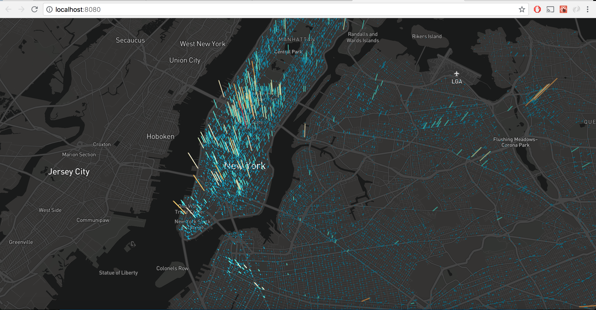

# NYC Crime Map Visualization

You can view this visualization here: https://crime-map-nyc.herokuapp.com/

## Screenshots

## Description
This project uses Uber's Deck.gl library to visualize NYC Grand Larceny data from 2017.

This is based on Uber's 3d-heatmap example: https://github.com/uber-common/deck.gl-data/tree/master/examples/3d-heatmap

The data comes from the NYC Open Data Website: https://data.cityofnewyork.us/Public-Safety/NYC-crime/qb7u-rbmr/data

## Running Locally
1. clone the project
2. npm install
3. npm run start-local
4. open application in browser with localhost:3000
   
